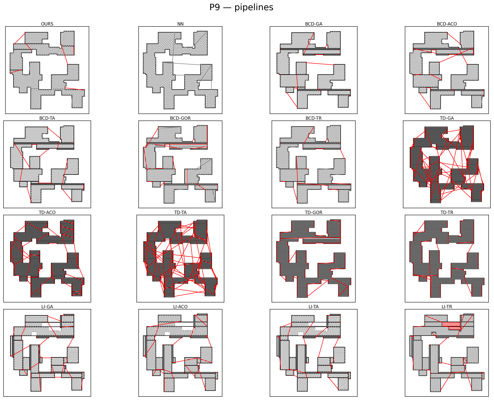

# CPP via Uniaxial Feasible, Gap-Severity Guided Decomposition


This repository provides a reference implementation for our CPP decomposition strategy, including dual-axis monotonic cuts guided by discontinuity severity.

##  Install

Requires: [Conda](https://docs.conda.io/en/latest/)
Tested on MacOs Sequoia, Linux Ubuntu Jammy Jellyfish

On repository root, run:

```bash
chmod +x install.sh
./install.sh
conda activate cpp_ufgsg
python -c "import cpp; print('cpp import OK')"
```

## Run

You can run our algorithm via `src/cpp/run.py`. The dataset is at stored in `src/cpp/artifacts/decompositions.pkl`.  
Outputs go to `src/cpp/artifacts/results` 

### Example
Generate paths for one polygon.

```bash
conda activate cpp_ufgsg
#run on one polygon
python -m cpp.run --polygon P12
# multiple
python -m cpp.run -p P1 P2 P12
# comma list
python -m cpp.run -p P1,P2,P12
# all (no flag)
python -m cpp.run
```

## Benchmark Polygons and Pipelines

We evaluate all baseline pipelines and our proposed method on a benchmark of 13 polygons.  
The benchmark spans varied shapes, scales, aspect ratios, holes, and clusters of concavities.  
These polygons mimic observed land-cover features such as woodlands, large water bodies, and
clusters of buildings, and they carry enough geometric complexity to pose real challenges for
coverage path planning pipelines.

Expand dropdown below to display polygons and generated paths for all baselines


<details><summary><b>P1</b></summary>

</details>

<details><summary><b>P2</b></summary>

</details>

<details><summary><b>P3</b></summary>

</details>

<details><summary><b>P4</b></summary>

</details>

<details><summary><b>P5</b></summary>

</details>

<details><summary><b>P6</b></summary>

</details>

<details><summary><b>P7</b></summary>

</details>

<details><summary><b>P8</b></summary>

</details>

<details><summary><b>P9</b></summary>

</details>

<details><summary><b>P10</b></summary>

</details>

<details><summary><b>P11</b></summary>

</details>

<details><summary><b>P12</b></summary>

</details>

<details><summary><b>P13</b></summary>

</details>
